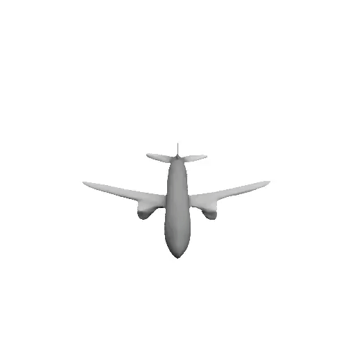
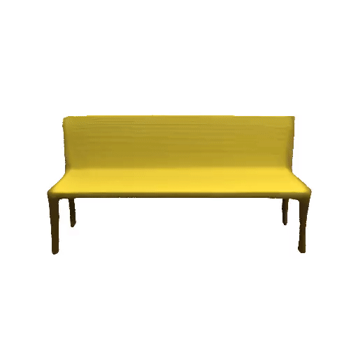
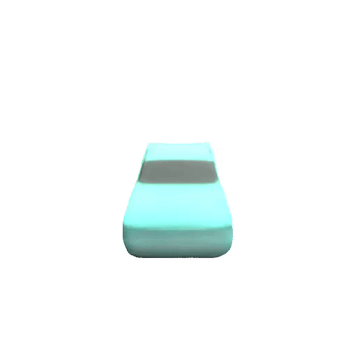
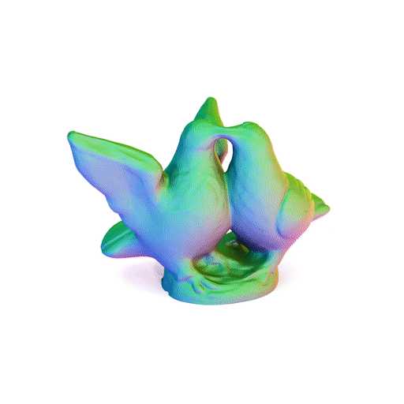
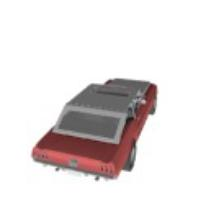
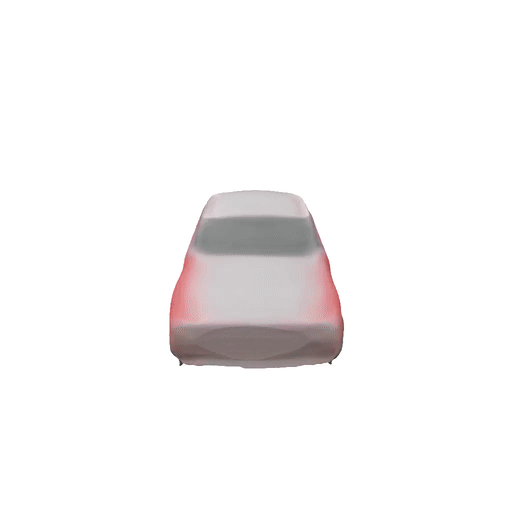
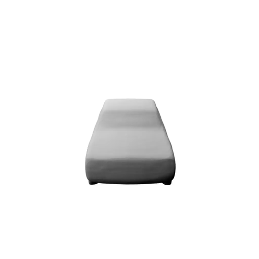

# Differentiable Volumetric Rendering
#### [Paper](http://www.cvlibs.net/publications/Niemeyer2020CVPR.pdf) | [Supplementary](http://www.cvlibs.net/publications/Niemeyer2020CVPR_supplementary.pdf) | [Spotlight Video](https://www.youtube.com/watch?v=lcub1KH-mmk) | [Blog Entry](https://autonomousvision.github.io/differentiable-volumetric-rendering/) | [Presentation](https://www.youtube.com/watch?v=U_jIN3qWVEw) | [Interactive Slides](https://m-niemeyer.github.io/slides/gtc/#/) | [Project Page](https://avg.is.tuebingen.mpg.de/publications/niemeyer2020cvpr)

<div style="text-align: center">






</div>

This repository contains the code for the paper
[Differentiable Volumetric Rendering: Learning Implicit 3D Representations without 3D Supervision](http://www.cvlibs.net/publications/Niemeyer2020CVPR.pdf).

You can find detailed usage instructions for training your own models and using pre-trained models below.

If you find our code or paper useful, please consider citing

    @inproceedings{DVR,
        title = {Differentiable Volumetric Rendering: Learning Implicit 3D Representations without 3D Supervision},
        author = {Niemeyer, Michael and Mescheder, Lars and Oechsle, Michael and Geiger, Andreas},
        booktitle = {Proc. IEEE Conf. on Computer Vision and Pattern Recognition (CVPR)},
        year = {2020}
    }

## Installation

First you have to make sure that you have all dependencies in place.
The simplest way to do so, is to use [anaconda](https://www.anaconda.com/).

You can create an anaconda environment called `dvr` using
```
conda env create -f environment.yaml
conda activate dvr
```
Next, compile the extension modules.
You can do this via
```
python setup.py build_ext --inplace
```

## Demo
<div style="text-align: center">
 



You can now test our code on the provided input images in the `demo` folder.
To this end, start the generation process for one of the config files in the `configs/demo` folder.
For example, simply run
```
python generate.py configs/demo/demo_combined.yaml
```
This script should create a folder `out/demo/demo_combined` where the output meshes are stored.
The script will copy the inputs into the `generation/inputs` folder and creates the meshes in the `generation/meshes` folder.
Moreover, the script creates a `generation/vis` folder where both inputs and outputs are copied together.

## Dataset

### Download Datasets

To evaluate a pre-trained model or train a new model from scratch, you have to obtain the respective dataset.
We use three different datasets in the DVR project: 
<ol type="a">
<li>ShapeNet for 2.5D supervised models (using the <a href="https://arxiv.org/abs/1604.00449">Choy et. al. renderings</a> as input and our renderings as supervision) </li>
<li>ShapeNet for 2D supervised models (using the <a href="https://arxiv.org/abs/1711.07566">Kato et. al. renderings</a>)</li>
<li>A subset of the DTU multi-view dataset </li>
</ol>

You can download our preprocessed data using
```
bash scripts/download_data.sh
```
and following the instructions. The sizes of the datasets are 114GB (a), 34GB (b), and 0.5GB (c).

This script should download and unpack the data automatically into the `data` folder.

### Data Convention

Please have a look at the [FAQ](https://github.com/autonomousvision/differentiable_volumetric_rendering/blob/master/FAQ.md) for details regarding the type of camera matrices we use.

## Usage
When you have installed all binary dependencies and obtained the preprocessed data, you are ready to run our pre-trained models and train new models from scratch.

### Generation
To generate meshes using a trained model, use
```
python generate.py CONFIG.yaml
```
where you replace `CONFIG.yaml` with the correct config file.

The easiest way is to use a pre-trained model.
You can do this by using one of the config files which are indicated with `_pretrained.yaml`. 

For example, for our 2.5D supervised single-view reconstruction model run
```
python generate.py configs/single_view_reconstruction/multi_view_supervision/ours_depth_pretrained.yaml
```
or for our multi-view reconstruction from RGB images and sparse depth maps for the birds object run
```
python generate.py configs/multi_view_reconstruction/birds/ours_depth_mvs_pretrained.yaml
```
Our script will automatically download the model checkpoints and run the generation.
You can find the outputs in the `out/.../pretrained` folders.

Please note that the config files  `*_pretrained.yaml` are only for generation, not for training new models: when these configs are used for training, the model will be trained from scratch, but during inference our code will still use the pre-trained model.

### Generation From Your Own Single Images

Similar to our demo, you can easily generate 3D meshes from your own single images. To this end, create a folder which contains your own images (e.g. `media/my_images`). Next, you can reuse the config file `configs/demo/demo_combined.yaml` and just adjust the [data - path](https://github.com/autonomousvision/differentiable_volumetric_rendering/blob/4ba785a2bfee0cc28324fbbd96c6e5e83f6899fc/configs/demo/demo_combined.yaml#L4) and [training - out_dir](https://github.com/autonomousvision/differentiable_volumetric_rendering/blob/4ba785a2bfee0cc28324fbbd96c6e5e83f6899fc/configs/demo/demo_combined.yaml#L6) arguments to your needs. For example, you can set the config file to
```
inherit_from: configs/single_view_reconstruction/multi_view_supervision/ours_combined_pretrained.yaml
data:
  dataset_name: images
  path: media/my_images
training:
  out_dir:  out/my_3d_models
```
to generate 3D models for the images in `media/my_images`. The models will be saved to `out/my_3d_models`.
Similar to before, to start the generation process, run
```
python generate.py configs/demo/demo_combined.yaml 
```
*Note:* You can only expect our model to provide reasonable results on data which is similar to what it was trained on (white background, single object, etc.). 


### Evaluation
For evaluation of the models, we provide the script `eval_meshes.py`. You can run it using
```
python eval_meshes.py CONFIG.yaml
```
The script takes the meshes generated in the previous step and evaluates them using a standardized protocol.
The output will be written to `.pkl`/`.csv` files in the corresponding generation folder which can be processed using [pandas](https://pandas.pydata.org/).

*Note:* We follow previous works to use "use 1/10 times the maximal edge length of the current object’s bounding box as unit 1" (see [Section 4 - Metrics](http://www.cvlibs.net/publications/Mescheder2019CVPR.pdf)). In practise, that means that we multiply the Chamfer-L1 metric by a factor of 10 for reporting the numbers in the paper.
    
    
### Training
Finally, to train a new network from scratch, run
```
python train.py CONFIG.yaml
```
where you replace `CONFIG.yaml` with the name of the configuration file you want to use.

You can monitor on <http://localhost:6006> the training process using [tensorboard](https://www.tensorflow.org/guide/summaries_and_tensorboard):
```
cd OUTPUT_DIR
tensorboard --logdir ./logs
```
where you replace `OUTPUT_DIR` with the respective output directory.

For available training options, please take a look at `configs/default.yaml`.

# Futher Information

## More Work on Implicit Representations
If you like the DVR project, please check out other works on implicit representions from our group:
- [Mescheder et. al. - Occupancy Networks: Learning 3D Reconstruction in Function Space (CVPR 2019)](https://avg.is.tuebingen.mpg.de/publications/occupancy-networks)
- [Oechsle et. al. - Texture Fields: Learning Texture Representations in Function Space (ICCV 2019)](https://avg.is.tuebingen.mpg.de/publications/oechsle2019iccv)
- [Niemeyer et. al. - Occupancy Flow: 4D Reconstruction by Learning Particle Dynamics (ICCV 2019)](https://avg.is.tuebingen.mpg.de/publications/niemeyer2019iccv)
- [Peng et. al. - Convolutional Occupancy Networks (ArXiv 2020)](https://arxiv.org/abs/2003.04618)
- [Oechsle et. al. - Learning Implicit Surface Light Fields (ArXiv 2020)](https://arxiv.org/abs/2003.12406)

## Other Relevant Works
Also check out other exciting works on inferring implicit representations without 3D supervision: 
- [Liu et. al. - Learning to Infer Implicit Surfaces without 3D Supervision (NeurIPS 2019)](https://arxiv.org/abs/1911.00767)
- [Sitzmann et. al. - Scene Representation Networks: Continuous 3D-Structure-Aware Neural Scene Representations (NeurIPS 2019)](https://arxiv.org/abs/1906.01618)
- [Liu. et. al. - DIST: Rendering Deep Implicit Signed Distance Function with Differentiable Sphere Tracing (CVPR 2020)](http://b1ueber2y.me/projects/DIST-Renderer)
- [Mildenhall et. al. - NeRF: Representing Scenes as Neural Radiance Fields for View Synthesis (ArXiv 2020)](https://arxiv.org/abs/2003.08934)
